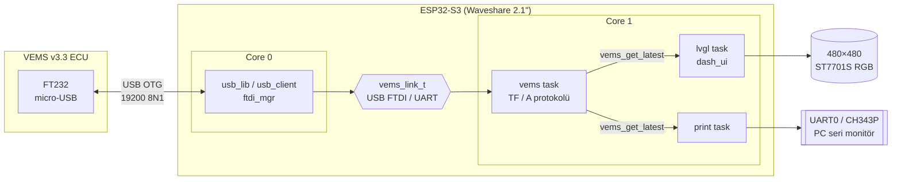

<div align="center">

# ESP32-VEMS

**VEMS v3 ECU için ESP32-S3 tabanlı canlı veri köprüsü ve 2.1" yuvarlak dijital gösterge paneli**


</div>

---

Waveshare **ESP32-S3-Touch-LCD-2.1** kartı, VEMS v3.3 ECU'ya (firmware 1.2.16) USB üzerinden bağlanır,
gerçek zamanlı motor verilerini okur, çözümler ve hem **480×480 yuvarlak ekranda** gösterge paneli olarak
çizer hem de **seri konsola** (isteğe bağlı JSON) yazar. Bilgisayar ya da VemsTune gerekmez.

## İçindekiler

- [Özellikler](#özellikler)
- [Mimari](#mimari)
- [Donanım](#donanım)
- [Hızlı başlangıç](#hızlı-başlangıç)
- [Yapılandırma (menuconfig)](#yapılandırma-menuconfig)
- [Ekran / Gösterge paneli](#ekran--gösterge-paneli)
- [Konsol çıktısı](#konsol-çıktısı)
- [Protokol](#protokol)
- [Proje yapısı](#proje-yapısı)
- [Sorun giderme](#sorun-giderme)
- [Kaynaklar](#kaynaklar)

## Özellikler

- 🔌 **USB host üzerinden doğrudan bağlantı** — VEMS üzerindeki FT232'yi süren minimal FTDI sürücüsü
  (baud, 8N1, latency timer, bulk I/O). Ek dönüştürücü gerekmez.
- 🔁 **Alternatif TTL/RS232 UART** taşıyıcı — tek `menuconfig` seçeneğiyle.
- 📡 **İki protokol + otomatik algılama** — VemsTune'un kullandığı *TriggerFrame* (HDLC + Modbus CRC16)
  ve eski MegaTune `A` komutu. Önce TF denenir, olmazsa `A`'ya düşülür.
- ✅ **CRC doğrulama, yeniden senkronizasyon ve istatistikler** (ok / timeout / crc / resync sayaçları).
- 🧮 **VemsTune ini dosyasından birebir ölçekleme** — RPM, MAP, CLT, IAT, TPS, akü, lambda/AFR, avans,
  enjektör süresi, VE, dwell, IAC, boost, durum bayrakları…
- 🖥️ **LVGL 8.2 gösterge paneli** — RPM halkası, kırmızı bölge, vites uyarısı, eşik renklendirmeli kartlar.
- 🧾 **Konsol çıktısı** — okunabilir satır + isteğe bağlı JSON (loglama / PC tarafı entegrasyon için).
- ⚙️ **Tamamen `menuconfig` ile ayarlanabilir** — baud, protokol, sorgu aralığı, RPM sınırları, parlaklık.

## Mimari



| Katman | Dosya | Görev |
|---|---|---|
| Taşıyıcı (transport) | `ftdi_host.c`, `uart_link.c` | `vems_link_t` arayüzü: `start / write / read / set_baud / flush_rx` |
| Protokol | `vems_proto.c` | Sorgu, HDLC çözme, CRC16, mod algılama, `vems_data_t` doldurma |
| Sunum | `dash_ui.c`, `main.c` | LVGL ekranı ve konsol/JSON çıktısı |
| Kart | `board_lcd.c` | TCA9554 IO genişletici, ST7701S init (3-wire SPI), RGB panel, arka ışık PWM |

## Donanım

### Gerekenler

| Parça | Not |
|---|---|
| [Waveshare ESP32-S3-Touch-LCD-2.1](https://www.waveshare.com/wiki/ESP32-S3-Touch-LCD-2.1) | 16 MB flash, 8 MB octal PSRAM, 480×480 ST7701S |
| VEMS v3.x ECU | Firmware 1.2.x (1.2.16 ile test edildi) |
| USB-C (erkek) → micro-USB (erkek) **OTG** kablo | ya da USB-C OTG adaptörü + veri hatlı micro-USB kablo |
| USB-C kablo (PC ↔ kart) | Flash ve seri monitör için |

### Bağlantı

Kartta **iki adet USB-C** vardır ve doğru porta takmak kritiktir:

| Port | Bağlı olduğu yer | Bu projedeki görevi |
|---|---|---|
| **USB Type-C** (native USB, GPIO19/20) | ESP32-S3 USB-OTG | **USB HOST** → VEMS micro-USB (FTDI) |
| **UART Type-C** (CH343P) | UART0, GPIO43/44 | PC: flash + seri monitör |

```
PC ──USB──► [UART Type-C / CH343P] ESP32-S3 [USB Type-C / native] ──OTG──► VEMS micro-USB (FT232)
```

> [!IMPORTANT]
> VEMS üzerindeki FT232 bir **USB cihazıdır**; onunla konuşmak için ESP32'nin **USB host** olması gerekir.
> Bu yalnızca native USB portunda mümkündür. Bu portta host modundayken **flash yapılamaz** — flash için
> CH343P portunu kullanın.

- PC'deki COM portu **CH343** olarak görünmelidir. `VID_303A&PID_1001` (native USB) görünüyorsa kablolar ters takılıdır.
- **VBUS (5 V):** FT232 USB'den beslenir. Native port host modunda VBUS'a 5 V vermiyorsa FTDI enumerate olmaz
  (log'da `USB device: VID=0403` satırı hiç çıkmaz). Bu durumda harici beslemeli OTG Y-kablo / powered hub kullanın.

### Alternatif: doğrudan UART

`menuconfig` → **VEMS Link** → *TTL UART* seçilirse USB yerine UART kullanılır (varsayılan TX=GPIO20, RX=GPIO19).

> [!WARNING]
> VEMS işlemci tarafı **5 V TTL**'dir; ESP32 RX hattında seviye dönüştürücü şarttır. RS232 (EC18) hattı için
> MAX3232 modülü kullanın. GND ortak olmalıdır.

### Kart pin haritası (ekran)

| İşlev | GPIO / Adres |
|---|---|
| I2C SDA / SCL (TCA9554 @ `0x20`) | 15 / 7 |
| ST7701S 3-wire SPI MOSI / SCLK | 1 / 2 |
| LCD RST / TP RST / LCD CS / Buzzer | TCA9554 EXIO1 / EXIO2 / EXIO3 / EXIO8 |
| RGB HSYNC / VSYNC / DE / PCLK | 38 / 39 / 40 / 41 (PCLK 18 MHz) |
| Arka ışık (LEDC PWM) | 6 |

## Hızlı başlangıç

**Gereksinim:** [ESP-IDF v5.3](https://docs.espressif.com/projects/esp-idf/en/v5.3/esp32s3/get-started/)

```powershell
# Windows / PowerShell örneği
$env:IDF_TOOLS_PATH = "$env:USERPROFILE\esp\esp-idf-tools"
# PATH'teki "python" Windows Store kısayolu ise IDF'in kendi Python ortamını öne alın
$env:PATH = "$env:IDF_TOOLS_PATH\python_env\idf5.3_py3.11_env\Scripts;C:\Program Files\Python311;" + $env:PATH
. "$env:USERPROFILE\esp\esp-idf-v5.3.5\export.ps1"

git clone https://github.com/erdemerciyas/esp32-vems.git
cd esp32-vems
idf.py set-target esp32s3      # ilk kez
idf.py build
idf.py -p COMxx flash monitor  # COMxx = CH343P portu
```

```bash
# Linux / macOS
. $HOME/esp/esp-idf/export.sh
idf.py set-target esp32s3 build
idf.py -p /dev/ttyACM0 flash monitor
```

## Yapılandırma (menuconfig)

`idf.py menuconfig` → **VEMS Link**

| Seçenek | Varsayılan | Açıklama |
|---|---|---|
| Bağlantı tipi | USB host (FTDI) | `USB host` veya `TTL UART` |
| UART port / TX / RX | 1 / 20 / 19 | Yalnızca UART modunda |
| Baud | `19200` | VEMS v3 varsayılanı (8N1) |
| Otomatik baud tarama | kapalı | Yalnızca CRC'li TriggerFrame sorgusuyla |
| Protokol | Otomatik | `Otomatik` / `Sadece TF (0xA0)` / `Sadece A` |
| Sorgu aralığı | `40 ms` | 0–2000 ms |
| Konsola yazdırma aralığı | `250 ms` | `0` = kapalı |
| JSON çıktı | kapalı | Her satırın ardından JSON |
| Ham HEX dump | `3` | İlk N cevabı HEX yazar (protokol doğrulama) |
| Gösterge paneli | açık | 2.1" ekran arayüzü |
| RPM maksimum | `8000` | 4000–12000 |
| Kırmızı bölge / vites uyarısı | `6500` | 2000–12000 |
| Parlaklık | `80 %` | 5–100 |

Kart seviyesindeki ayarlar (`sdkconfig.defaults`): 16 MB flash, 8 MB octal PSRAM @ 80 MHz, konsol UART0 @ 115200,
240 MHz CPU, 1 kHz FreeRTOS tick, zayıf beslenen FTDI için uzatılmış USB enumerasyon süreleri ve hub desteği.

## Ekran / Gösterge paneli

LVGL 8.2 ile 480×480 yuvarlak ekrana çizilir:

- **Dış halka:** 0 – `RPM_MAX` devir. Turkuaz; 5500 üstü turuncu, `RPM_SHIFT` üstü kırmızı. Kırmızı bölge ve tikler sabit.
- **Orta:** bağlantı durumu (`VEMS A 19200` 🟢 / `VEMS BEKLENIYOR` 🟠 / `VERI YOK` 🔴) ve büyük RPM rakamı.
  Vites uyarı devrinde rakam kırmızı olur.
- **Kartlar:** MAP, LAMBDA, TPS / CLT, IAT, AKÜ. Eşik aşılınca turuncu / kırmızı
  (ör. CLT ≥ 98 / 105 °C, akü < 12.5 / 11.5 V).
- **Alt:** ADV / PW / VE, motor durum bayrakları (`RUN`, `CRANK`, `WARM`, `IDLE`, `CL`, `CUT`) ve veri hızı (Hz).

## Konsol çıktısı

CH343P portundan 115200 baud ile:

```text
RPM   850 | MAP  34.5 kPa | CLT  82.0 C (r182) | IAT  31.0 C (r131) | TPS   0.0 % | BAT 14.1 V | LAMBDA 1.00 (AFR 14.7) | ADV  14.0 | PW  2.10 ms | VE  48 | RUN | ok=1234 to=0 crc=0 age=12ms
```

`VEMS_PRINT_JSON` açıkken ek olarak:

```json
{"seq":1234,"rpm":850,"map":34.5,"clt":82.0,"iat":31.0,"tps":0.0,"batt":14.10,"lambda":1.000,"afr":14.70,"lambda_tgt":1.000,"adv":14.0,"pw":2.100,"dwell":3.52,"ve":48,"ego_corr":100,"warm":100,"iac":25.1,"status":129,"status1":4}
```

> Veriye kod içinden erişmek için: `vems_get_latest(&data)` ve `vems_get_stats(&stats)` (`main/vems_proto.h`).

## Protokol

VEMS v3 seri hattı: **19200 baud, 8N1**.

| Mod | İstek | Cevap |
|---|---|---|
| **TriggerFrame** (VemsTune'un yöntemi) | `7E A0 BF 38 7E` | `HDLC(payload, 0x20, CRC16_LE) 7E` |
| **MegaTune "A"** (eski uyumlu) | `A` | 56 bayt ham veri (CRC yok) |
| TF modundan çık | `7E B1 7F 34 7E` | – |

- `A0` = `READ_REALTIME_STUFFED_TYPE_COMMAND`, `BF 38` = Modbus CRC16 (little-endian).
- HDLC kaçış: `7E` → `7D 5E`, `7D` → `7D 5D`.

<details>
<summary><b>56 baytlık veri düzeni (tıklayın)</b></summary>

Ölçekleme VemsTune'un tanım dosyası `vemsTune-v3-1.2.15.ini` `[OutputChannels]` bölümünden alınmıştır.
VemsTune 1.2.16 için 1.2.15 ini'sini kullanır; 1.2.17'de de ilk 56 bayt aynıdır.

| Offset | Alan | Dönüşüm |
|---|---|---|
| 0 | secl | sayaç |
| 1 | boost_dc_alt | x × 100 / 255 % |
| 2 | engine status | bit0 run, bit1 crank, bit2 startw, bit3 warmup, bit4 accel, bit5 decel, bit7 idle |
| 4-5 | MAP | U16 BE / 4 → kPa |
| 6 | IAT | x − 100 → °C |
| 7 | CLT | x − 100 → °C |
| 8 | TPS | x × 100 / 255 % |
| 9 | Akü | x × 30 / 255 V |
| 10 / 12 | WBO2 1 / 2 | x > 211 ? (8x − 1171) / 32 / 14.7 : (x + 306) / 470 → lambda |
| 11 | EGO düzeltmesi | % |
| 13 | Isınma zenginleştirme | (x + 45) × 2 % |
| 14-15 | RPM | U16 BE |
| 16-17 | Enjektör süresi | U16 BE × 0.004 ms |
| 18 | Baro düzeltmesi | (x + 272) × 0.25 % |
| 19 | Gamma | x × 0.99 % |
| 20 | VE | % |
| 21 | Dwell | x × 0.064 ms |
| 22 | Avans | x / 2 − 64 derece |
| 23 | IAC | x × 100 / 255 % |
| 24-39 | MCP3208 kanalları (EGT1/EGT2/EBP/FP/...) | ham 12 bit |
| 40 | Lambda hedefi | 256 / (x + 200) |
| 47 | status1 | bit7 ALS, 6 launch, 5 shiftcut, 4 igncut, 3 idle, 2 closed loop |
| 48 / 49 | Boost hedef / duty | x × 4 kPa / x × 100 / 255 % |

> Not: eski MegaTune (1.1.x) tanımında sıcaklık °F + 40 idi; 1.2.x'te °C + 100 olarak değişti.

</details>

## Proje yapısı

```
esp32-vems/
├── CMakeLists.txt
├── sdkconfig.defaults        # Kart/PSRAM/USB host/LVGL varsayılanları
├── main/
│   ├── main.c                # app_main, konsol/JSON yazdırma görevi
│   ├── Kconfig.projbuild     # "VEMS Link" menuconfig menüsü
│   ├── vems_link.h           # Taşıyıcı soyutlaması (vems_link_t)
│   ├── ftdi_host.c           # USB host üzerinde minimal FTDI sürücüsü
│   ├── uart_link.c           # Alternatif düz UART taşıyıcı
│   ├── vems_proto.c/.h       # TriggerFrame / "A" protokolü, algılama, çözümleme
│   ├── board_lcd.c/.h        # TCA9554 + ST7701S + RGB panel + arka ışık
│   └── dash_ui.c/.h          # LVGL gösterge paneli
└── components/
    └── lvgl/                 # LVGL 8.2 (MIT)
```

## Sorun giderme

| Belirti | Olası neden / çözüm |
|---|---|
| Log'da `USB device: VID=0403` hiç yok | Native porta VBUS gelmiyor → beslemeli OTG Y-kablo / powered hub. Kablonun veri hatlı olduğundan emin olun. |
| PC'de `VID_303A&PID_1001` görünüyor | PC kablosu native porta takılı → **UART Type-C (CH343P)** portunu kullanın. |
| Ekranda `VEMS BEKLENIYOR` | FTDI bağlandı ama cevap yok → baud'u kontrol edin, `VEMS_AUTO_BAUD`'u deneyin, protokolü `Sadece A`'ya alın. |
| `crc=` sayacı artıyor | Hat gürültüsü / yanlış baud. `VEMS_DUMP_RAW_FRAMES` ile ham çerçeveleri inceleyin. |
| Sıcaklıklar mantıksız | Eski (1.1.x) firmware: ölçekleme °F + 40 formatındadır. |
| Satır sonunda `(STALE)` | Son yazdırmadan beri yeni çerçeve gelmedi; bağlantıyı kontrol edin. |

## Kaynaklar

- VEMS TriggerFrame: <http://www.vems.hu/wiki/index.php?page=SerialComm%2FTriggerFrameFormat>
- VEMS firmware değişiklikleri: <http://www.vems.hu/wiki/index.php?page=GenBoard%2FUnderDevelopment%2FFirmwareChanges>
- VEMS MegaTune paketi (comm.c + vemsv3.ini): <http://vems.hu/download/megatune/VemsMT1.1.27beta2.zip>
- Waveshare wiki: <https://www.waveshare.com/wiki/ESP32-S3-Touch-LCD-2.1>
- LVGL 8.2 dokümantasyonu: <https://docs.lvgl.io/8.2/>

## Lisans

`components/lvgl` LVGL Kft. tarafından [MIT lisansı](components/lvgl/LICENCE.txt) ile dağıtılmaktadır.
